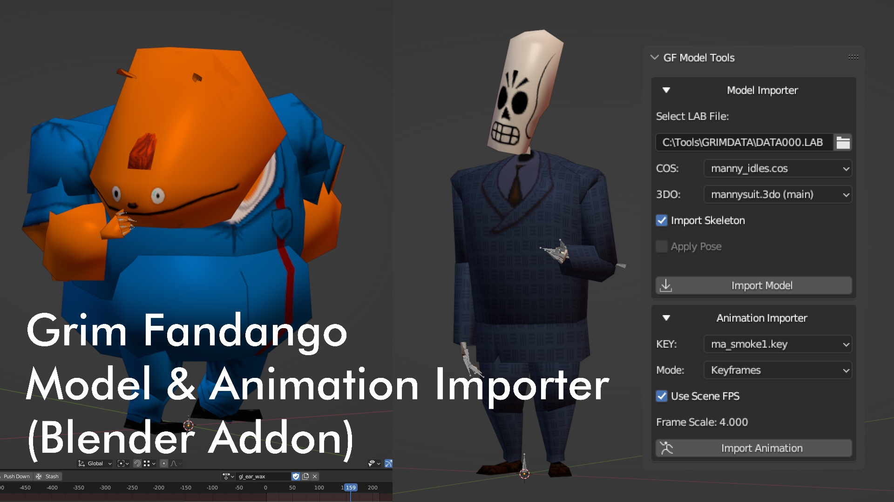

# GF Model Tools

Blender add-on for importing Grim Fandango models, textures, skeletons, and KEY animations from LAB archives.

## Installation

Install GF Model Tools like a regular Blender add-on:

1. Zip the `gf_model_tools` folder.
2. In Blender, open `Edit > Preferences > Add-ons`.
3. Click `Install...` and select the zip file.
4. Enable `GF Model Tools`.

After enabling the add-on, open the 3D View sidebar and select the `GF Tools` tab.

## Basic Workflow

GF Model Tools imports assets through Grim Fandango LAB and COS files.

COS files are costume files. They link a model to its related palette, materials, skeleton data, and animations.

1. Select a LAB file.
2. Choose a COS file from the populated COS list.
3. Choose a 3DO model from the populated 3DO list.
4. Import the model.
5. Choose a KEY animation from the populated KEY list.
6. Import the animation onto the selected armature.

For most characters, choose the 3DO marked `(main)`.

## Model Importer

The model importer reads the selected 3DO, finds its related CMP palette and MAT textures through the selected COS file, then creates Blender mesh objects.

Imported MAT textures are converted into Blender images and packed into the `.blend` file.

### Options

`Import Skeleton`

Creates a Blender armature from the 3DO hierarchy and attaches the imported meshes to the matching bones. This is required if you want to import KEY animations.

`Apply Pose`

Applies the 3DO node transforms directly to the imported mesh geometry. This option is only available when `Import Skeleton` is disabled.

When `Import Skeleton` is enabled, `Apply Pose` is disabled because the armature handles the mesh transforms.

## Animation Importer

The animation importer reads KEY files attached to the selected model and imports them as Blender actions on the selected Grim armature.

Re-importing an animation with the same name replaces the existing action. Importing a different animation creates a separate action.

### Options

`Mode`

Choose how animation keys are inserted.

- `Keyframes` imports only the keyframes stored in the KEY file.
- `Sampled` evaluates the animation and inserts a keyframe on every Blender frame.

`Use Scene FPS`

Grim Fandango animations are authored at 15 FPS. When this option is enabled, GF Model Tools spaces the imported keyframes to match the current Blender scene FPS.

For example, at 60 FPS, each Grim Fandango frame spans 4 Blender frames.

When this option is disabled, the importer ignores scene FPS and maps one Grim Fandango frame to one Blender frame.

## Notes

Animations for one character may be spread across multiple COS files, and not every COS file contains all related data.

For example, a COS file may contain a useful animation but no palette data. In that case, import the character model from another COS file that includes the palette and materials, then import the animation from the COS file that contains it.
